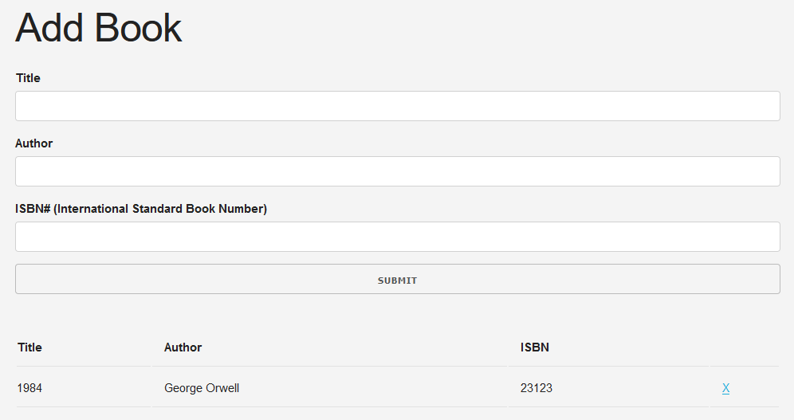

## Book List (Lista de Livros)
- (pt-br)
  Aplicação que lista livros, seus autores e códigos de livros, com programação Orientada a Objetos.
- (en-us)
  Book listing app, with authors and book codes, with Object Oriented Programming.

Link: <a href="https://capelaum-booklist.netlify.app" target="_blank">Book List (Lista de Livros)</a>

  

