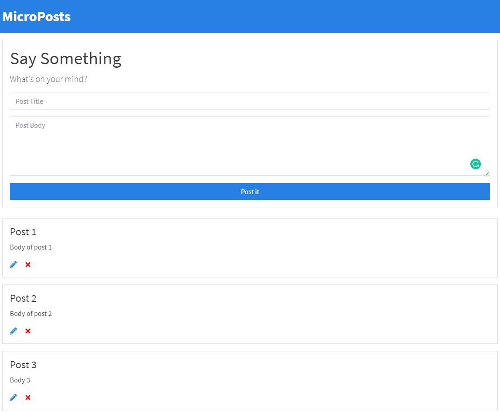

# Micropost

CRUD Application for creating, deleting and updating small posts using mainly vanilla Javascript and Json-Server Fake API
#### [Live Demo](https://capelaum-microposts.netlify.app)



## Usage

### Installation

Install the dependencies

```sh
$ npm install
```

### JSON-Server

Run JSON-Server locallly: change the `app.js` file, replacing where is `baseUrl` to `localhost` in the API calls

### Serve
To serve in the browser  - Runs webpack-dev-server

```sh
$ npm start
```

### Build
Compile and build

```sh
$ npm run build
```

## More Info

### Tech

- [Webpack](https://webpack.js.org/)
- [Babel](https://babeljs.io/)
- [Bootswatch](https://bootswatch.com/)
- [JSON-Server](https://www.npmjs.com/package/json-server)

### Credits

Made in this [Udemy JavaScript Course](https://www.udemy.com/course/modern-javascript-from-the-beginning) from Brad Traversy - [Traversy Media](http://www.traversymedia.com)

### License

This project is licensed under the MIT License