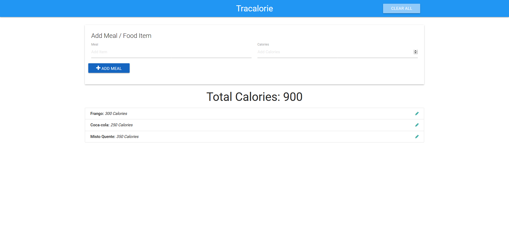

## Tracalorie (Registro de calorias)
- pt-br
  Aplicação que registra calorias de alimentos ingeridos durante um dia ou período de tempo, utiliza Local Storage.
- en-us
  Application that records calories from food eaten during a day or period of time, uses Local Storage.

Link: <a href="https://capelaum-tracalorie.netlify.app" target="_blank">Tracalorie (Registro de calorias)</a>

  

